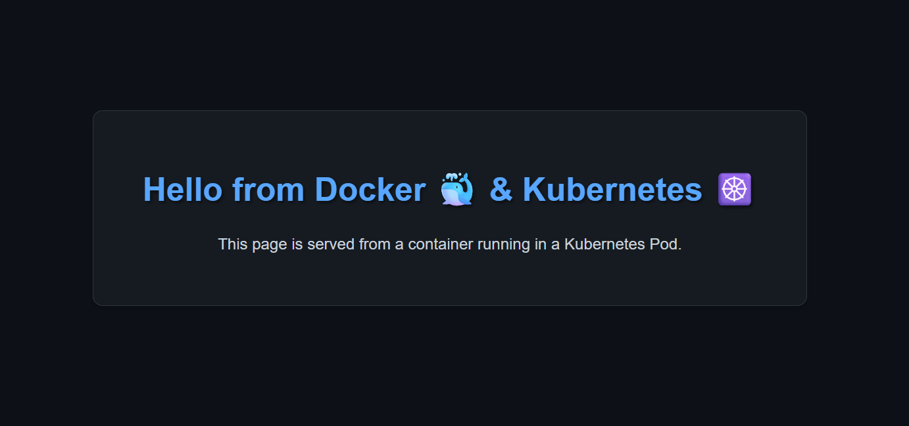

# Hello World Container 🚀  


---

## 📄 Project Summary  
This project demonstrates a **DevOps workflow** by containerizing a Python Flask app and deploying it on a Kubernetes cluster.  
The *Hello World* app serves as an **end-to-end Cloud Engineer portfolio project**, showcasing **Docker + Kubernetes** integration.  

---

## 🚀 About the Project  
This repository provides a **step-by-step cloud-native workflow**, covering:  
- **Python/Flask** → Lightweight web server with `"Hello from Docker & Kubernetes"`  
- **Dockerfile** → Packaging the app into a container image  
- **Docker Hub** → Storing & sharing the image  
- **Kubernetes Deployment** → Defining pods & replicas  
- **Kubernetes Service** → Exposing the app externally  

---

## 🛠️ Prerequisites  

- [Docker](https://docs.docker.com/get-docker/) → Build and run images  
- [kubectl](https://kubernetes.io/docs/tasks/tools/) → Manage Kubernetes resources  
- [Minikube](https://minikube.sigs.k8s.io/docs/start/) → Local K8s cluster  

---

## 📁 Project Structure  

* Docker-k8s Projects/
* └── Hello World Container/
  * ├── app.py # Flask application
  * ├── Dockerfile # Build instructions for image
  * ├── k8s-deploy.yaml # Kubernetes manifest (Deployment + Service)
  * └── output.png # Screenshot of deployed app


---

## 👨‍💻 Step-by-Step Workflow  

### 🔹 Step 1: Build & Run with Docker  

**Build Image:**  
```bash
docker build -t vaibhavnalla0202/flask-docker-k8s-demo:latest .

## Run Container Locally:
docker run -p 5000:5000 vaibhavnalla0202/flask-docker-k8s-demo:latest

👉 Open: http://localhost:5000

## Push Image to Docker Hub:
docker push vaibhavnalla0202/flask-docker-k8s-demo:latest

```
---

### 🔹 Step 2: Deploy on Kubernetes 
**Apply Deployment & Service:**
```bash
kubectl apply -f k8s-deploy.yaml
```
**Check Pods & Services:**
```bash
kubectl get pods
kubectl get svc
```
**Access via Minikube:**
```bash
minikube service flask-demo-service
```
---

## 🐳 Docker Commands Cheat Sheet
```bash
# List images
docker images

# List containers
docker ps -a

# Stop container
docker stop <container_id>

# Remove container + image
docker rm <container_id> && docker rmi <image_id>
```
---

## ☸️ Kubernetes Commands Cheat Sheet
```bash
# List all pods
kubectl get pods

# List services
kubectl get svc

# Get deployments
kubectl get deployments

# Describe pod
kubectl describe pod <pod_name>

# Delete deployment + service
kubectl delete -f k8s-deploy.yaml
```
---

# 💻 Technologies Used

### Python 🐍 → Programming language
### Flask ⚡ → Web framework
### Docker 🐳 → Containerization
### Kubernetes (K8s) ☸️ → Orchestration
### Minikube 🖥️ → Local K8s cluster

# 📸 Output



## ✍️ Author

### Vaibhav Nalla

[🌐 GitHub Profile](https://github.com/vaibhavnalla15/Docker-K8s-Projects.git)