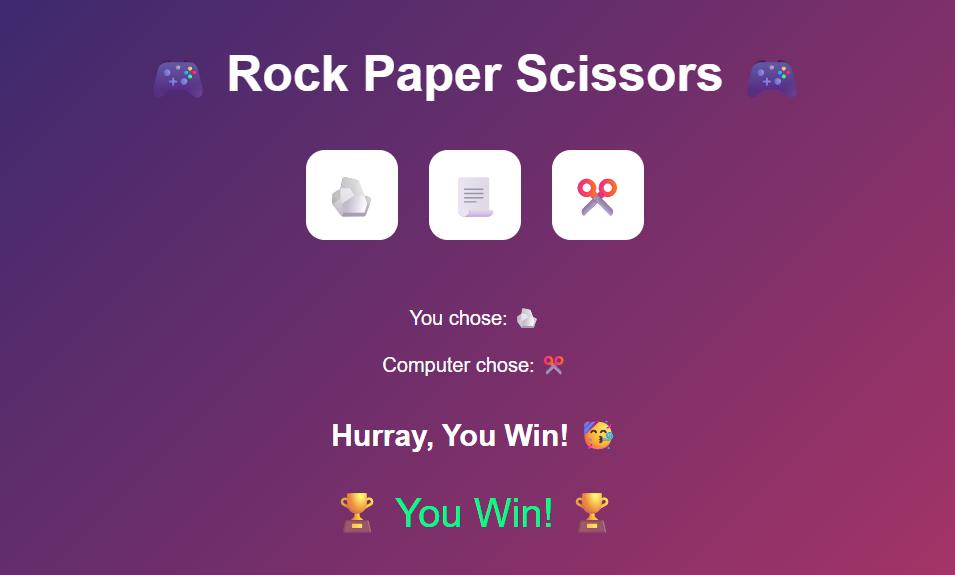

# 🎮 Rock-Paper-Scissors Game Web App


---

## 📄 Project Summary  
This project is a simple, yet powerful, demonstration of a full-stack web application. It showcases a classic **Rock-Paper-Scissors** game built with 
**Python** and **Flask**, containerized using **Docker**, and deployed on a **Kubernetes cluster**.

---

## 🚀 About the Project  
* **Simple Gameplay:** Play a classic game of Rock-Paper-Scissors against the computer.
* **Responsive UI:** A clean, modern UI built with embedded CSS that adapts to different screen sizes.
* **Containerization:** The entire application is packaged into a Docker image for consistent and reliable deployment.
* **Kubernetes-Ready:** The project includes Kubernetes manifest files (Deployment and Service) to orchestrate the application on a cluster.

---

## 🛠️ Technical Stack
* **Backend:** Python 3.10
* **Web Framework:** Flask
* **Containerization:** Docker
* **Orchestration:** Kubernetes

---

## 📁 Project Structure 

* Docker-k8s Projects/
* └── RPS-Web-App/
    * ├── Dockerfile
    * ├── game.py
    * ├── requirements.txt
    * └── k8s/
        * ├── deployment.yaml
        * └── service.yaml

## 👨‍💻 Step-by-Step Workflow  

### 🔹 Step 1: Build & Run with Docker  

**Build Image:**  
```bash
docker build -t vaibhavnalla0202/rps-web-game:latest  .

## Run Container Locally:
docker run -p 5000:5000 vaibhavnalla0202/rps-web-game:latest  

👉 Open: http://localhost:5000

## Push Image to Docker Hub:
docker push vaibhavnalla0202/rps-web-game:latest 

```
---

### 🔹 Step 2: Deploy on Kubernetes 
**Apply Deployment & Service:**
```bash
kubectl apply -f k8s/
```
**Check Pods & Services:**
```bash
kubectl get pods
kubectl get svc
```
**Access via Minikube:**
```bash
minikube service flask-demo-service
```
---

## 🐳 Docker Commands Cheat Sheet
```bash
# List images
docker images

# List containers
docker ps -a

# Stop container
docker stop <container_id>

# Remove container + image
docker rm <container_id> && docker rmi <image_id>
```
---

## ☸️ Kubernetes Commands Cheat Sheet
```bash
# List all pods
kubectl get pods

# List services
kubectl get svc

# Get deployments
kubectl get deployments

# Describe pod
kubectl describe pod <pod_name>

# Delete deployment + service
kubectl delete -f k8s/
```
---

# 💻 Technologies Used

### Python 🐍 → Programming language
### Flask ⚡ → Web framework
### Docker 🐳 → Containerization
### Kubernetes (K8s) ☸️ → Orchestration
### Minikube 🖥️ → Local K8s cluster

# 📸 Output



## ✍️ Author

### Vaibhav Nalla

[🌐 GitHub Profile](https://github.com/vaibhavnalla15/Docker-K8s-Projects.git)